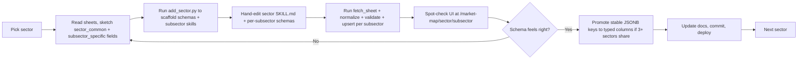

## What changes vs. the original M8

Original M8 was "provision Supabase, build schema, seed 500+ projects, replace `/market-map` placeholder". Two problems:

1. The "500+" number forces premature data work before we've learned what the schema should be.
2. There's no system for the next agent to extend the dataset without re-deriving everything.

New M8 ships infra **once**, then iterates one sector at a time. Each sector loop sharpens the schema and produces a new sub-skill so the next sector is faster.

## 3-tier data model (the core idea)

Every project row has:

- **Universal columns** (typed Postgres columns) — apply to every project, every sector. Things like `name`, `slug`, `website_url`, `description`, `status`, `stage`, `founded_year`, `hq_country`, `team_size_range`, `total_funding_usd`, `last_funding_round`, `last_funding_date`, `twitter_handle`, `github_url`, `logo_url`.
- **`sector_attributes jsonb`** — fields common to all subsectors within a sector. Schema declared in `sectors.common_field_schema`. E.g. Core Protocol Architecture might define `consensus_mechanism`, `client_implementations`, `chain_layer` (L1/L2/L3) across all 5 subsectors.
- **`subsector_attributes jsonb`** — fields specific to one subsector. Schema declared in `subsectors.specific_field_schema`. E.g. Consensus Layer might define `finality_time_ms`, `validator_count`; MEV & Block Builders might define `bundle_market`, `relay_type`.

JSONB + JSON-schema-per-sector lets us evolve fields without migrations every time we learn something. When a field stabilizes across enough sectors, we promote it to a typed column.

## Supabase schema (M8.1)

```sql
create table sectors (
  slug text primary key,                  -- 'core-protocol-architecture'
  name text not null,
  description text,
  display_order int not null,
  common_field_schema jsonb not null default '{}'::jsonb
);

create table subsectors (
  slug text primary key,                  -- 'consensus-layer'
  sector_slug text not null references sectors(slug),
  name text not null,
  description text,
  display_order int not null,
  source_sheet_id text,                   -- gviz import metadata
  source_sheet_gid text,
  specific_field_schema jsonb not null default '{}'::jsonb,
  unique (sector_slug, display_order)
);

create table projects (
  id uuid primary key default gen_random_uuid(),
  slug text unique not null,
  name text not null,
  description text,
  website_url text,
  logo_url text,
  twitter_handle text,
  github_url text,
  status text,                            -- live | testnet | mainnet | archived
  stage text,
  founded_year int,
  hq_country text,
  team_size_range text,
  total_funding_usd bigint,
  last_funding_round text,
  last_funding_date date,
  sector_slug text not null references sectors(slug),
  subsector_slug text not null references subsectors(slug),
  sector_attributes jsonb not null default '{}'::jsonb,
  subsector_attributes jsonb not null default '{}'::jsonb,
  source_row_hash text,                   -- to detect sheet changes
  source_last_synced_at timestamptz,
  created_at timestamptz not null default now(),
  updated_at timestamptz not null default now()
);

create index projects_sector_idx on projects (sector_slug);
create index projects_subsector_idx on projects (subsector_slug);
create index projects_name_trgm on projects using gin (name gin_trgm_ops);

-- RLS: anon can read, only service_role can write.
alter table sectors enable row level security;
alter table subsectors enable row level security;
alter table projects enable row level security;
create policy "public read" on sectors for select using (true);
create policy "public read" on subsectors for select using (true);
create policy "public read" on projects for select using (true);
```

Pre-seed all 7 sector rows and all 36 subsector rows up front (including their `source_sheet_id`/`source_sheet_gid`) so the navigation can render even when project counts are still zero. Projects fill in sector-by-sector.

## FastAPI routes (M8.2, read-only)

In [backend/app/routes/market_map.py](backend/app/routes/market_map.py) (new):

- `GET /api/market-map/sectors` — all sectors with `subsector_count` + `project_count`.
- `GET /api/market-map/sectors/{sector_slug}` — sector + nested subsectors + counts.
- `GET /api/market-map/subsectors/{subsector_slug}/projects` — paged.
- `GET /api/market-map/projects` — `?sector=&subsector=&search=&stage=` filters.
- `GET /api/market-map/projects/{slug}` — full project incl. both JSONB blobs + the schemas describing them.

Backed by `supabase-py` (anon key for reads) or direct `httpx` to PostgREST. Add `SUPABASE_URL` + `SUPABASE_ANON_KEY` + `SUPABASE_SERVICE_ROLE_KEY` to [backend/.env.example](backend/.env.example) and the Render env table in [DEPLOYMENT.md](DEPLOYMENT.md).

## Frontend (M8.3)

Replace [frontend/app/market-map/page.tsx](frontend/app/market-map/page.tsx) (today a `ComingSoonShell`) with real data:

- `/market-map` — sector grid (7 tiles) using the `MarketMapVisual` design language from [frontend/components/landing/Features.tsx](frontend/components/landing/Features.tsx#L102-L137): tile per sector, count of subsectors + count of live projects, gradient progress bar. Server component fetching from the FastAPI route.
- `/market-map/[sector]` — subsector grid + flat project list.
- `/market-map/[sector]/[subsector]` — project table with filters (stage, status, funding range).
- `/market-map/project/[slug]` — detail page rendering universal fields + a section per attribute group, labels driven by `common_field_schema` / `specific_field_schema`.

Keep the same cyber/dark aesthetic and `.glass` / `glow-ring` patterns. No new design system work.

## The Claude Skill (M8.4) — audited against the framework

Folder structure inside the repo (NOT global, per your choice):

```
.cursor/skills/market-map/
├── SKILL.md                    # entry skill — universal fields, ingest flow, audit rules
├── scripts/                    # deterministic, no token cost
│   ├── fetch_sheet.py          # gviz CSV pull: (sheet_id, gid) -> rows
│   ├── normalize_row.py        # column rename map -> universal/sector/subsector buckets
│   ├── upsert_projects.py      # idempotent upsert via Supabase service-role
│   ├── validate_schema.py      # JSON-schema check of sector_attributes/subsector_attributes
│   ├── add_subsector.py        # scaffold subsector row + skill stub + schema stub
│   └── add_sector.py           # scaffold sector + N subsectors at once
├── schemas/                    # JSON Schema files referenced from DB rows
│   ├── universal.json
│   ├── sectors/<sector>.json
│   └── subsectors/<subsector>.json
├── sectors/
│   └── core-protocol-architecture/
│       ├── SKILL.md            # sector-common fields, sector-specific conventions
│       └── subsectors/
│           ├── consensus-layer.md
│           ├── execution-layer.md
│           ├── validators-staking-providers.md
│           ├── mev-block-builders.md
│           └── network-upgrades.md
└── README.md
```

Applying the audit framework from your screenshot:

**1. Visibility**
- `SKILL.md` (entry) frontmatter sets `disable-model-invocation: true` for any sub-skill that wraps a side-effecting script (`upsert_projects`, `add_sector`, `add_subsector`) — the agent must be explicitly invoked by you, not auto-fire.
- Sector/subsector reference skills (background knowledge: "what fields does Consensus Layer use, what does each mean") set `user-invocable: false` so they don't clutter `/menu`. They're loaded automatically when the agent is working in this repo.
- The top-level `market-map` SKILL.md and `add_sector` / `add_subsector` scaffolds remain user-invocable so you can run them deliberately.

**2. Deterministic vs non-deterministic**
- Deterministic = scripts (no AI): `fetch_sheet.py` (URL build + CSV parse), `normalize_row.py` (string -> typed value + column-rename mapping), `validate_schema.py` (JSON Schema check), `upsert_projects.py` (Supabase write + row hash), `add_subsector.py` / `add_sector.py` (template render). These run with zero tokens.
- Non-deterministic = AI: deciding which columns from a new sheet are universal vs sector-common vs subsector-specific; writing the sector's description; promoting a JSONB key to a typed column once it stabilizes. The skill markdown documents *how to make those judgments*, then hands off to the scripts.

**3. Composability**
- `fetch_sheet.py`, `normalize_row.py`, `validate_schema.py`, `upsert_projects.py` are shared across every sector and subsector — extracted to `scripts/` once.
- Sector SKILL.md files don't repeat the universal-field list; they `include` it by reference.
- `add_subsector.py` reuses `add_sector.py`'s template engine.

The skill also documents the L3 & Appchain Frameworks sheet caveat ("flagged as having issues — manual review before ingest") so it doesn't surprise the next agent.

## Sector-by-sector loop (M8.5+)

Run one full loop on **Core Protocol Architecture** (5 subsectors) as the pilot. Then each subsequent sector is mostly data work using the same scripts.



Per-sector exit criteria (used as the M8.X exit gate):

- All subsectors for that sector have a populated schema + at least the projects from the source sheet ingested.
- `/market-map/<sector>` renders the subsector grid with non-zero project counts on each tile.
- Skill file for the sector is committed and audited (visibility + scripts + composability checked).

## Phased milestone breakdown

We keep M8 as the umbrella, with explicit sub-milestones. M9/M10/M11 numbering is unchanged.

- **M8.1** Supabase provision + schema migrations + seed sectors/subsectors rows (no projects yet).
- **M8.2** FastAPI read-only `/api/market-map/*` routes + Supabase env wiring in [backend/](backend/), [backend/.env.example](backend/.env.example), [DEPLOYMENT.md](DEPLOYMENT.md).
- **M8.3** `/market-map` UI: sector grid + sector page + subsector page + project detail. Replace [ComingSoonShell](frontend/components/layout/ComingSoonShell.tsx) usage in [frontend/app/market-map/page.tsx](frontend/app/market-map/page.tsx).
- **M8.4** `.cursor/skills/market-map/` bootstrap: `SKILL.md`, all shared `scripts/`, `add_sector.py` / `add_subsector.py` scaffolds, `schemas/universal.json`. Update [docs/AI_CONTEXT.md](docs/AI_CONTEXT.md) section 3 (repo layout) and add a "How to add a sector" subsection.
- **M8.5** Pilot sector: **Core Protocol Architecture** (5 subsectors). Iterate fields. Deploy.
- **M8.6** Rollup & Scaling Frameworks (4 subsectors). Resolve the L3 & Appchain Frameworks sheet issue before ingest.
- **M8.7** Monetary & Access Rails (6 subsectors).
- **M8.8** DeFi Systems Architecture (6 subsectors).
- **M8.9** Data & Consensus Infrastructure (5 subsectors).
- **M8.10** Advanced Compute & Integration (5 subsectors).
- **M8.11** Governance & Enterprise Framework (5 subsectors).

**M8 exit (top level):** all 7 sectors visible at `/market-map` with real, sheet-sourced projects in production; skill folder fully populated; field schemas stable enough that adding a new project to an existing subsector is a one-command script invocation.

## Doc + decisions updates

- New entry in [docs/DECISIONS.md](docs/DECISIONS.md): "M8 ships sector-by-sector with 3-tier JSONB schema" — rationale, alternatives considered (typed per-sector tables; pure EAV), when to revisit (promote JSONB → typed when a key stabilizes across 3+ sectors).
- Update [README.md](README.md) M8 row to reflect the sub-milestones and the "500+" claim coming from real data, not seeded placeholder rows.
- Update [docs/AI_CONTEXT.md](docs/AI_CONTEXT.md) sections 3 (repo layout — add `.cursor/skills/market-map/`), 4 (stack — add Supabase + supabase-py), 6 (env vars — `SUPABASE_URL`, `SUPABASE_ANON_KEY`, `SUPABASE_SERVICE_ROLE_KEY` on backend; `NEXT_PUBLIC_SUPABASE_URL`, `NEXT_PUBLIC_SUPABASE_ANON_KEY` on frontend if we ever read directly from the browser — defer that decision), and 8 (milestone protocol — note the M8.x decomposition).

## Open items to decide at M8.1 kickoff

- **Supabase region**: us-east-1 by default; pin to whichever region your Vercel deploys to (likely `iad1`). Will confirm at provision time.
- **supabase-py vs raw PostgREST httpx**: lean toward `supabase-py` for ergonomics; raw `httpx` is a fine fallback if the Python SDK conflicts with our async stack.
- **L3 & Appchain Frameworks sheet issue**: flagged for manual review when we hit M8.6 — please re-share the screenshot you intended to attach so I can address the specific issue before ingest.